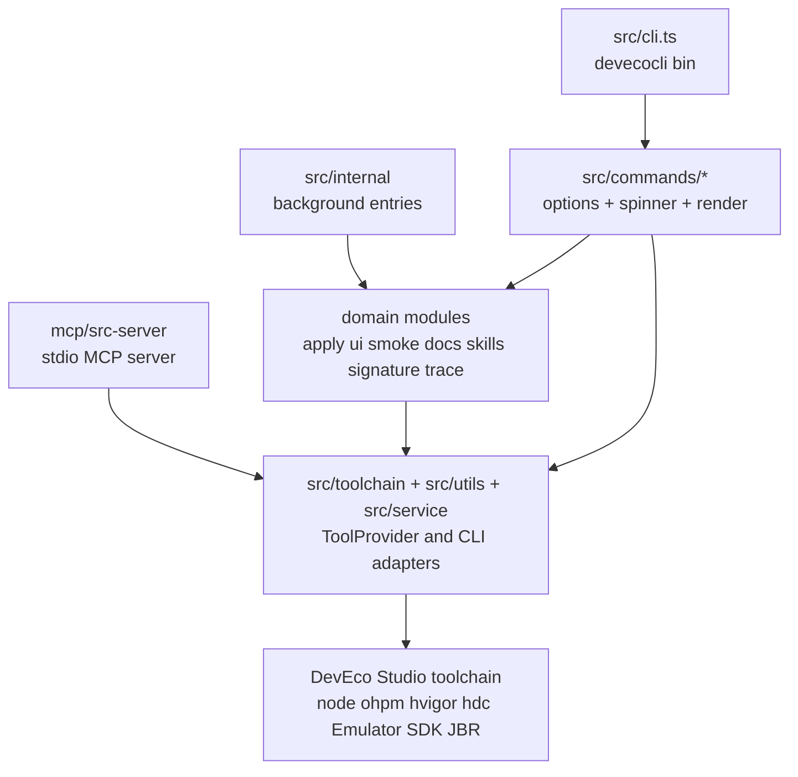
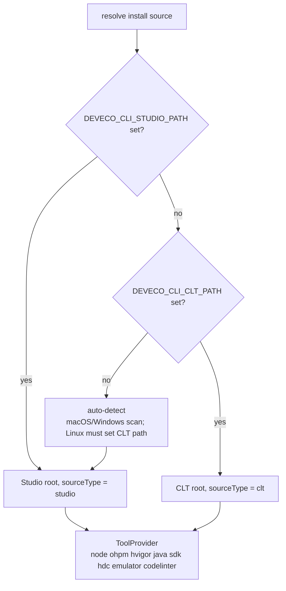
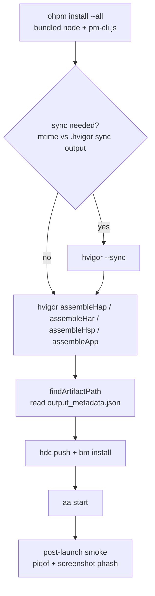
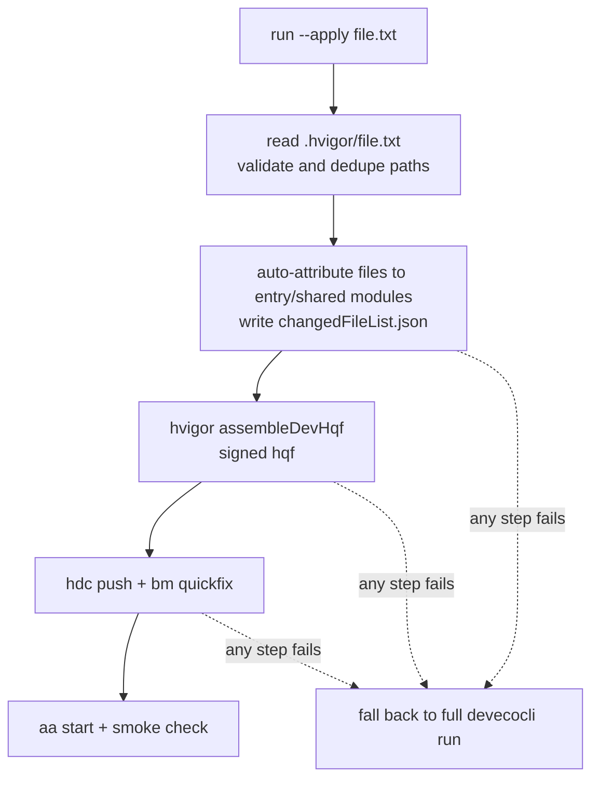

# deveco-cli 技术概览

> 本文档基于对仓库源码的通读，以及在本机的实际构建与运行验证编写。
> 所有"实测"结论均给出来源命令与原始输出摘录；未能验证的部分在 §3.6 明确列出。

| 项 | 值 |
| --- | --- |
| 仓库 | `deveco-cli`（包名 `@deveco-test/deveco-cli`，版本 `1.3.3-Test.2`） |
| 分析基线 commit | `2aa3100`（`!485 merge fix/run-module-multi-value into develop`） |
| 文档目录 | `docs/`（本文件为新增，仓库此前无根级 `docs/` 目录） |
| 结论 | 本地可完整构建、测试、运行；核心链路（脚手架 → 构建 → 部署 → 启动 → UI 检查）已在真机模拟器上端到端跑通 |

---

## 1. 项目定位

`devecocli` 把 DevEco Studio 工具链（自带的 `node`、`ohpm`、`hvigor`、`hdc`、`Emulator`、SDK、JBR）统一封装成**单一命令入口**，并额外提供四类能力：

1. **项目生命周期**：脚手架（`create`）、构建（`build`）、部署运行（`run`）、增量热更（`run --apply` / `--hotreload`）。
2. **设备与观测**：设备/模拟器管理（`device`、`emulator`）、日志（`log`）、UI 自动化与截图（`ui`）。
3. **静态检查**：Code Linter（`check lint`）、ArkTS 检查（`check arkts`）、SDK API 兼容性扫描（`check compat`），并把这套能力通过 **MCP server**（`serve mcp`）暴露给 AI Agent。
4. **周边服务**：HarmonyOS 技能市场安装（`skills`、`init`）、离线文档检索（`docs`）、登录鉴权（`auth`）、调试签名（`signature`）、自更新（`update`）。

分发形态是**一个压缩后的 ESM bundle**：`dist/cli.js`（bin 名 `devecocli`），外加两个后台入口。

---

## 2. 事实基线

### 2.1 运行时与依赖

- 要求 Node.js `>= 22`（`package.json → engines`）；本机实测 `v25.9.0` / npm `11.12.1`。
- ESM（`"type": "module"`）。**内部 import 必须写 `.js` 后缀**，即使源文件是 `.ts`。
- 核心运行时依赖：`commander`（命令框架）、`execa`（子进程）、`ora`（spinner）、`axios` + `global-agent`（网络与代理）、`proper-lockfile`（构建锁/索引锁）、`json5`（HarmonyOS 配置解析）、`@modelcontextprotocol/sdk`（MCP）、`@sqlite.org/sqlite-wasm` + `jieba-wasm`（文档检索）、`yauzl` + `adm-zip`（zip 读取/打包）、`node-forge`（签名相关密码学）、`socket.io-client`（hvigor daemon 热重载）。
- 注意：HarmonyOS 配置一律是 JSON5（`build-profile.json5`、`module.json5`、`oh-package.json5`、`app.json5`），**必须用 `json5` 解析**，不能用原生 `JSON.parse`。

### 2.2 构建产物（`npm run build` 实测）

```
ESM dist/internal/doc-init-background.js         10.76 KB
ESM dist/internal/telemetry-upload-background.js 16.74 KB
ESM dist/cli.js                                  713.14 KB
ESM ⚡️ Build success in 629ms
```

`tsup.config.ts` 的关键选择：三个 entry、`format: esm`、`target: node22`、`minify: true`、`splitting: false`、`clean: true`，并把 `jieba-wasm` / `@sqlite.org/sqlite-wasm` / `yauzl` 标为 `external`（含 WASM 资源，不能内联）。构建期通过 `env` 把 `npm_package_version` / `npm_package_name` / `npm_config_tag` 注入 bundle。

### 2.3 源码规模

| 区域 | 行数（`*.ts`） | 职责 |
| --- | --- | --- |
| `mcp/src-server` | ~12.3k | 内置 stdio MCP server + ArkTS/C++ LSP 代理 |
| `src/commands` | ~6.9k | 命令壳：选项定义 + spinner + 渲染 |
| `src/utils` | ~5.4k | `ohpm`/`hvigor`/`hdc`/`hilog` 适配器、项目模型、构建锁 |
| `src/docs` | ~4.9k | 离线文档索引、SQLite 检索、按需读 zip |
| `src/signature` | ~4.4k | 调试签名材料生成与写回工程配置 |
| `src/apply` | ~2.9k | 增量部署（`--apply`）与热重载 |
| `src/smoke` | ~1.9k | 启动后自动验收（崩溃/白屏判定） |
| `src/auth` | ~1.7k | 登录流程与 token 加密存储 |
| `src/ui` | ~1.7k | UI 树抓取、截图、输入注入 |
| `src/skills` | ~1.5k | 技能市场客户端与安装器 |
| `src/trace` | ~1.4k | 遥测采集、加密落盘、后台上报 |
| `src/service` | ~1.3k | `DeviceManager` / `EmulatorManager` |
| `src/toolchain` | ~1.1k | `ToolProvider`：工具链发现与路径解析 |

合计约 52k 行 TypeScript。

---

## 3. 本地构建与运行验证（实测记录）

### 3.1 环境

| 项 | 实测值 |
| --- | --- |
| 平台 | macOS（darwin） |
| Node / npm | `v25.9.0` / `11.12.1` |
| DevEco Studio | `6.1.1.300`，位于 `/Applications/DevEco-Studio.app`（自动发现成功） |
| SDK | 本机最高 API level `24`（`create` 自动探测得到） |
| 连接设备 | 模拟器 `Pura 90`，`127.0.0.1:5555` |

> 工具链自动发现：macOS 会扫描 `~/Applications` 与 `/Applications` 下的 `.app`，按 `Contents/Resources/product-info.json` 的 `name === "DevEco Studio"` 精确识别。本机无需设置任何 `DEVECO_*` 变量即可通过启动时的版本校验（Studio `>= 6.0.0` / CLT `>= 26.0.0`）。

### 3.2 依赖安装

```bash
npm install
# added 583 packages in 3m
```

`prepare` 钩子会执行 `husky`；`postinstall` 只在 `dist/internal/doc-init-background.js` 已存在时才拉起文档索引初始化子进程（**因此首次 `npm install` 不触发，构建后的再次安装才会触发**）。

### 3.3 构建

```bash
npm run build     # tsup → dist/（见 §2.2）
```

构建通过，产物可执行：

```bash
$ node dist/cli.js --help          # 列出 16 个一级命令，退出码 0
$ node dist/cli.js --version
1.3.3-Test.2
```

### 3.4 质量门禁

| 检查 | 命令 | 结果 |
| --- | --- | --- |
| 单元测试 | `npm test`（Vitest） | **12 个文件 / 125 个用例全部通过**，11.86s |
| 静态检查 | `npm run lint`（ESLint） | 退出码 0，无告警 |

测试覆盖集中在纯逻辑与适配器编排：UI 树解析与折叠（`src/ui/layout/*.test.ts`）、hdc 适配器与参数拼接、模拟启动 smoke 判定（`src/smoke/*.test.ts`）、技能安装器、文档索引 zip 集成（含中文 Markdown 端到端检索）。

### 3.5 端到端功能验证

在模拟器在线的前提下，跑通了完整链路：

```bash
# 1) 脚手架：API level 自动探测为 24，模板完整性校验通过
$ node dist/cli.js create --project-path ./.tmp-verify/HelloApp \
      --app-name HelloApp --bundle-name com.example.helloapp
Project created successfully.
Template integrity check passed.

# 2) 构建：ohpm install --all → hvigor sync → assembleHap
$ node dist/cli.js build
> hvigor Finished :entry:default@CompileArkTS... after 12 s 98 ms
> hvigor Finished :entry:default@PackageHap... after 1 s 316 ms
> hvigor WARN: Will skip sign 'hos_hap'. No signingConfigs profile is configured...
> hvigor BUILD SUCCESSFUL in 20 s 351 ms
Build completed successfully
# 产物：entry/build/default/outputs/default/entry-default-unsigned.hap (126,777 B)

# 3) 部署 + 启动 + 自动验收
$ node dist/cli.js run --skip-build --device 127.0.0.1:5555
App installed successfully
Application 'com.example.helloapp': start ability successfully.
Smoke: PASS

# 4) UI 层确认应用真的渲染出来了
$ node dist/cli.js ui window list
103  helloapp0  19285  0  true
$ node dist/cli.js ui layout --device 127.0.0.1:5555
[0,0,1320,2856]
  Text#HelloWorld [170,1345,1151,1550] "Hello World" clickable

# 5) 静态检查
$ node dist/cli.js check arkts entry/src/main/ets/pages/Index.ets
No errors found in 1 file(s).
$ node dist/cli.js check lint
No defects found.

# 6) 网络能力：技能市场
$ node dist/cli.js skills list
✔ Fetched 40 skills

# 7) MCP server 握手（JSON-RPC over stdio）
$ echo '<initialize + tools/list>' | devecocli serve mcp
serverInfo: {"name":"devecocli-mcp-server","version":"0.0.1"}
tools: ["check", "restart"]
```

`run` 之后 `Smoke: PASS` 是 CLI 自己给出的验收结论——它会 `pidof` 目标 bundle 判断进程存活，并截图做感知哈希（phash）白屏判定（详见 §5.2）。

验证用的临时工程与数据目录（`.tmp-verify/`、`.tmp-cli-data/`）已删除，测试应用也已从模拟器卸载，工作树恢复干净（`git status` 无输出）。

### 3.6 未能验证的部分及原因

| 项 | 原因 |
| --- | --- |
| `docs search` / `docs read` / `docs catalog` | 索引依赖 `index.zip` 与 `docs.zip`，二者是**发布产物、不在版本库中**。实测 `docs catalog` 报 `docs.zip not found`。同理 `npm run build:index` 也需要根目录存在 `docs.zip` 才能运行。 |
| `check compat` | 要求 DevEco Studio `>= 26.0.0.810`（`COMPAT_MIN_STUDIO_VERSION`），本机为 `6.1.1.300`。 |
| `auth login` / `signature generate` | 需要华为账号登录与云端证书/设备注册，属于有外部副作用的交互流程，本次未执行。`auth status` 实测正常返回 `Not logged in`。 |
| `emulator` 生命周期命令 | 会创建/删除本机虚拟设备与镜像，副作用较大，仅验证了其依赖的 `device list` 路径（`emulator` 命令的 `preAction` 要求 Studio ≥ 6.1.0，本机满足）。 |
| 渲染中的 `--apply` / `--hotreload` | 需要 DevEco Studio `>= 6.1.1`（本机满足 `6.1.1.300`）**且**必须先执行过一次 `run` 以生成 `buildConfig.json`；本次未构造增量场景。 |

### 3.7 本次验证中遇到的环境限制（非项目缺陷）

`src/utils/process-rss.ts` 的内存采样会 `execFile('ps', ['-o','rss=','-p',pid])`。在受限沙箱环境中 `ps` 被拒绝执行时，`npm run build` 之外的多条链路（`build`、`check lint`、`check arkts`、`compat`、`serve lsp`）都会中断：

```
Executing: ps -o rss= -p 55660
Error: spawn EPERM
    at ChildProcess.spawn (node:internal/child_process:440:11)
```

原因是 `readProcessRss()` 只处理了 `execFile` 的**回调错误**，没有兜住 `spawn` 的**同步抛出**，异常从 `setInterval` 回调逃逸后终结进程。在正常环境（`ps` 可用）下不会触发；在容器/受限 CI 中可能表现为"构建直接崩溃"。工程上值得加一层 `try/catch` 或让采样失败退化。放开该限制后，上述命令全部正常通过（即 §3.5 的结果）。

---

## 4. 架构

### 4.1 分层



三条真实的进程入口：

| 入口 | 何时启动 | 说明 |
| --- | --- | --- |
| `src/cli.ts` | 用户执行 `devecocli` | 唯一的用户可见 bin；Commander 入口；`global-agent` 代理引导；`preAction` 版本校验、`postAction` 升级提示 |
| `src/internal/doc-init-background.ts` | `postinstall` 之后 detached 启动 | 只 import 文档初始化器，**不加载 `cli.ts`**，因此不跑命令解析与工具链校验 |
| `src/internal/telemetry-upload-background.ts` | 任一命令结束时按条件 detached 启动 | 执行遥测 `flush()` + 失败重试 |

### 4.2 命令清单

一级命令 15 个：`build`、`run`、`update`、`device`、`emulator`、`auth`、`skills`、`log`、`create`、`init`、`serve`、`docs`、`ui`、`check`、`signature`；另有 Commander 内置的 `help`。

其中 `serve` 有 `mcp` / `lsp` 两个子命令，`check` 有 `compat` / `lint` / `arkts`，`ui` 有 `layout` / `window` / `screenshot` 与 8 个输入注入命令（`click`、`doubleclick`、`longclick`、`swipe`、`fling`、`drag`、`dircfling`、`text`）。

CLI 层有两个易被忽略的兼容处理（都在 `src/cli.ts`）：`-v` 在解析前被改写成 `-V`（Commander 的 `.version()` 只支持一个短选项），以及 `devecocli <command> help` 被改写成 `<command> --help`（Commander 只对有子命令的命令自动支持）。

### 4.3 目录职责

```
src/
├── cli.ts                    # Commander 入口；代理引导；preAction 版本校验
├── commands/                 # 一命令一文件，保持薄：选项 + spinner + 渲染
├── toolchain/                # ToolProvider：Studio/CLT 发现与组件路径解析
├── utils/                    # 适配器：ohpm / hvigor / hdc / hilog + 项目模型 + 构建锁
├── service/                  # DeviceManager / EmulatorManager 等领域服务
├── apply/                    # 增量部署与热重载（含 hotreload/ 子模块）
├── ui/                       # UI 树抓取 / 截图 / 输入注入
├── smoke/                    # 启动后自动验收
├── docs/                     # 离线文档索引与检索
├── skills/                   # 技能市场客户端与安装器
├── auth/                     # 登录、token 加密存储
├── signature/                # 调试签名材料生成
├── trace/                    # 遥测采集/加密/上报
├── compat/  codelinter/  arktscheck/   # 三类静态检查
├── update/  install-check/   # 自更新与安装位置一致性检查
├── internal/                 # 后台入口（tsup entry）
└── config/  data/  types/    # 常量、端点、内置数据、共享类型
mcp/src-server/               # 内置 MCP server（ArkTS/C++ 检查走 LSP）
templates/application/        # `create` 使用的工程模板
scripts/postinstall.mjs       # 安装后拉取文档索引
index/                        # `npm run build:index` 的索引构建源码
```

---

## 5. 核心机制

### 5.1 工具链解析：`ToolProvider`

`src/toolchain/tool-provider.ts` 是整个 CLI 的地基：**只解析路径与能力，不执行任何外部命令**。构造函数私有，只能经 `ToolProvider.new()` / `fromCLT()` / `fromIDE()` 创建。

安装根解析优先级（`resolveInstallSourceUncached()`）：



- 缓存的是**安装源解析结果的 Promise**（`static installSourcePromise`），所以环境变量读取、注册表查询、目录扫描每进程只做一次；`ToolProvider.new()` 本身每次返回新实例。
- 解析出的组件路径都用 `resolvePathInsideRoot()` 断言落在 `toolchainRoot` 内，防止路径逃逸。
- `sourceType`（`clt` / `studio`）决定能力边界：`assertStudio()`、`assertLsp()`、`getApiscanPaths()` 在 CLT 下直接拒绝；CLT 不自带 JBR（回退 `JAVA_HOME` / `PATH`），arkts-lang-server 目录布局也不同。**不能假设每个组件在所有平台都存在。**
- 版本门槛：CLT `>= 26.0.0`、Studio `>= 6.0.0`（CLI 启动校验）；`check compat` 另需 Studio `>= 26.0.0.810`；`emulator` 需 Studio `>= 6.1.0`；`run --apply` 需 Studio `>= 6.1.1`。

### 5.2 构建 / 运行 / 增量

`build` 与 `run` 共用同一段构建实现（`executeBuildSteps()`），顺序固定：



要点：

- `ohpm install --all` **总是执行**；`hvigor --sync` 只在配置 mtime 变化时执行（否则打印 "Skipped (configurations unchanged)"）。
- 任务按模块类型选择：`shared` → `assembleHsp`，`har` → `assembleHar`，其余 → `assembleHap`；指定 `--product` 且不指定模块时走 `assembleApp`。
- 产物路径来自 `<module>/build/<product>/intermediates/hap_metadata/<target>/output_metadata.json`。**真机要求最终包名以 `-signed.hap` 结尾**，否则报 "Real devices cannot install unsigned packages."；模拟器允许未签名包——这正是本次 `run --skip-build` 能直接安装未签名 HAP 的原因。
- 并发保护：`withBuildLock()` 用 `proper-lockfile` 锁 `<projectRoot>/.hvigor/.build-lock`（`stale: 5000`，抢不到则每秒重试、永久等待）。`build`、`build clean`、`run` 的构建阶段、`ApplyManager` 都走它。
- **`buildConfig.json` 只由 `run` 生成，`build` 不生成**——这是 `--apply` 文档里"先跑一次 `run`"的代码依据。

`--apply` 快速增量：



- 参数是**工程根 `.hvigor/` 下的纯文件名**（不允许带路径），文件内容是一行一个变更文件路径（跳过空行与 `#` 注释）——它是**输入清单，不是 hvigor 产物**。
- 模块由文件路径自动归属，不依赖 `--module`；`har` 的变更会经反向依赖图传播到顶层 `entry`/`shared` 消费者。
- `bm quickfix` 在设备 API `> 17` 时追加 `-o`（用 `param get const.ohos.apiversion` 判定）。
- 任何环节失败都会**回退到完整 `devecocli run`**，而不是报错退出。

**启动后 smoke 验收**（仅 `run` 与 `--apply` 成功路径调用，`build` 不调用）：等待 `DEVECO_CLI_SMOKE_WAIT_MS`（默认 1000ms）→ `pidof` 判断进程存活 → 存活则截图并做 phash 白屏判定（DCT + 中位数二值化，与纯色基准汉明距离 `<= 10` 即判定 blank）→ 判定规则：进程死亡 = `FAIL_CRASH`，白屏 = `FAIL_BLANK`，无法取证则保守 PASS 并附跳过原因。证据（截图/崩溃日志）落在**工程内** `<projectRoot>/.hvigor/smoke/run-<ts>-<pid>-<nonce>/`，PASS 时立即丢弃，失败时保留 24h 供排查。

### 5.3 设备与模拟器

- `src/service/device-manager.ts` 是"当前连接了什么"的**唯一来源**：`hdc list targets` 解析 serial + status，跳过 `[Empty]` 与 `unauthorized`；名称与详情通过 `hdc shell param get` 读取并按优先级回退到 serial。
- 设备选择统一走 `src/utils/device-selector.ts`：`--device` 接受名称或序列号；**多设备且未指定时抛错并列出候选，绝不默认挑一台**。
- 模拟器生命周期（`emulator list/start/stop/create/delete/image ...`）全部委托给 `Emulator` 二进制，`src/service/emulator-manager.ts` **不做任何文件系统读写**；启动采用多策略重试（`-start <name>` 与 `-hvd <name> -path <instancePath>` 两套参数候选）并轮询 hdc 状态最多 60s。
- 隐私/服务协议写在本机 `Emulator<maj>.<min>` 目录下的 `.emu_config`；`emulator license view` 只打印不落盘，裸 `emulator license` 在 TTY 下交互确认。

### 5.4 UI 自动化

`src/ui/` 是仓库里最完整地贯彻"领域模块范式"的目录：

```
src/ui/
├── index.ts              # 唯一 barrel，只导出适配器与类型
├── layout/               # types → parsers/collapse（纯函数） → dump-adapter
├── screenshot/           # types → hdc-snapshot（纯函数） → screenshot-capturer
├── input/                # types（校验 + 方向映射） → adapter
└── window/               # types → fetcher
```

- 视图层级抓取：`hdc shell uitest dumpLayout -p <远端json>` → `hdc file recv` → `JSON.parse` → 删除本地与远端临时文件。适配器暴露的是**场景化的方法**（`dumpFullTree` / `dumpCollapsedTree`），而不是一个通用 `dump(options)`。
- 折叠算法（`layout/collapse.ts`）：**无 `id`、无 `text`、且 clickable/longClickable/scrollable/checkable 全为假**的节点视为纯包装节点被折叠掉，其子节点提升到最近的已输出祖先；`--depth` 只在输出节点时递增。
- 文本取值用 `originalText` 而非 `text`。
- 输入注入统一走 `uitest uiInput`；坐标与 `--id` 互斥，`--id` 会先抓树定位节点中心，命中 0 个或多于 1 个都报错；文本通过 base64 + `printf` 转义，避免 shell 注入。
- 注意：感知哈希（phash）**不在 `src/ui/`**，而在 `src/smoke/screen-phash.ts`，服务于 `run` 的 smoke 验收；`ui screenshot` 不调用它。

### 5.5 MCP server 与 LSP

`devecocli serve mcp` 启动一个 stdio MCP server（`mcp/src-server/`），把一个 HarmonyOS 工程变成 Agent 可查询的"代码理解服务"：

- 启动阶段读 `PROJECT_PATH`、`DEVECO_CLI_CPP_ENABLED`、`NODE_MAX_OLD_SPACE_SIZE` 等，`ToolProvider.new()` 一次性固定 `sdkPath` / `arktsLangServerPath` / `nodePath` / `clangdPath` 等并注入 `createMcpServer()`；客户端未提供 `PROJECT_PATH` 时通过 MCP `roots` 协商获取工程根。
- 双状态机：`ProjectLifecycle`（IDLE → DISCOVERING → SYNCING → INITIALIZING → READY/ERROR）与 `CppLifecycle`；工程未就绪时工具返回 "please retry in Ns" 而不是硬失败。
- ArkTS 侧经 `ArktsLspManager` → `LspServerProxy` → `LspClient` 拉起 DevEco 自带的 ace-server；C++ 侧经 `ClangdLspManager` 拉起 `clangd --compile-commands-dir=<project>/.idea/.deveco/cxx`，所需的 `compile_commands.json` 由 `hvigor compileNative` 产出后合并。
- 诊断暴露为拉取式：`didOpen` → `textDocument/diagnostic` → `didClose`。本次实测（`DEVECO_CLI_CPP_ENABLED=false`）`tools/list` 返回 `check`（ArkTS + C/C++ 混合校验）与 `restart` 两个工具；位置类工具（`hover`/`definition`/`declaration`/`references`/`implementation` 等）只在 `standardIndex/index.js` 存在时才注册。
- `DEVECO_CLI_CPP_ENABLED=false|0` 会跳过 `compileNative` 与 clangd，C++ 工具返回明确的"已禁用"错误。
- 另有两个**与 MCP 无关**的桥接命令：`serve lsp --arkts|--cpp` 只做 stdin/stdout 透明字节转发，把 LSP 握手留给编辑器。

### 5.6 文档检索

- 索引预构建为 `index.zip`（含 `search.db` + `build-meta.json` + 三份中文词表），由 `postinstall` 解压到 `<数据目录>/docs/.index`；正文 `docs.zip` **从不整体解压**，`docs read` 时用 `yauzl` 按需读单个条目。
- 检索用 `@sqlite.org/sqlite-wasm` 在内存中反序列化 SQLite 库并查询 FTS5；**jieba 只在 JS 侧切词**（索引用 `cut_for_search`，查询用 `cut`，配合 HarmonyOS 用户词典与同义词/停用词表），FTS5 分词器是内置的 `unicode61`。
- 排序在 `bm25()` 基础上叠加标题命中权重、目录权重与若干降权规则，并把"版本说明/变更预告"类目录置于末尾。
- `awaitDocReady()` 是命令侧的等待点：索引就绪则静默返回，否则起 spinner 并每 500ms 轮询 `build-status.json`；并发由 `proper-lockfile` 锁保证"等待而非重复安装"。

### 5.7 技能市场与 Agent 集成

- 端点硬编码在 `src/config/skills.ts`（`https://matrix.openharmony.cn`，tags / skills / checksum / install 四个接口，无鉴权头）。下载后做 **size 严格相等 + SHA-256 比对**，再用 `adm-zip` 解压，并对技能名与解压路径做白名单与包含性校验（防 zip-slip）。
- 支持 11 个 Agent 目标（含 `opencode`、`claude-code`、`codex`、`cursor`、`dsh` 等），全局安装目录形如 `~/.{agent}/skills`，部分支持项目级目录。
- `devecocli init` 的 `--skill`（默认，安装本包的 `SKILL.md` 技能）与 `--mcp`（向 Agent 配置写入 `deveco-mcp` 条目）互斥：前者装"怎么用 CLI 的知识"，后者装"MCP 工具"。

### 5.8 认证与隐私

- `auth login` 走本机回环 OAuth：随机 `clientSecret` → `http` 监听 `127.0.0.1:0` 的 `/callback`（Host 白名单 + `timingSafeEqual` 校验 code）→ 打开浏览器 → 换取 JWT → 落盘。
- token 存储为 AES-256-GCM 信封，随机 DEK 由 KEK 包裹；KEK 是随机生成的本机密钥文件（`0o600`），**不依赖口令派生，也不使用系统钥匙串**。
- 登录成功后会向隐私协议服务上报同意记录；`--help` 描述里常驻隐私声明链接。
- 遥测：事件按天写入 `<数据目录>/TraceLogData/telemetry-YYYY-MM-DD.txt`，**每行一个 AES-256-GCM 密文**，密钥材料为本机随机生成且不出网；上报触发条件是"距首个事件 ≥ 5 分钟"**或**"存在 7 天内的失败批次且距上次重试 ≥ 1 小时"；唯一关闭方式是 `DEVECO_CLI_DISABLE_TELEMETRY`（**没有同意文件**）。

### 5.9 签名

`signature generate` **不直接签 HAP**，而是生成调试签名材料并写回工程 `build-profile.json5` 的 `signingConfigs`：预检环境 → 判定是否需要重建 → 生成本地密钥对与 CSR → 云端申请/下载证书（校验 SHA-256）→ 注册设备 UDID → 下载并校验 profile → 写入配置。密码学工具链使用 Studio 自带 JBR 执行 SDK 里的 `hap-sign-tool.jar`（**不用系统 keytool**），密码用 AES-128-GCM + PBKDF2-SHA256 加密存储。

### 5.10 自更新

`postAction` 钩子（命令成功后）异步检查更新并打印提示；缓存与锁在 `<数据目录>/update/` 下，检查窗口是**本地时区每日 21:00 至次日 21:00**。发布方可在 npm 包元数据里声明 `blockedVersions`，命中的版本会在 `preAction` 阶段被直接拒绝执行并提示 `devecocli update`——这是"召回坏版本"的逃生机制。注意 `DEVECO_CLI_SKIP_VERSION_CHECK` 位于该门禁**之后**，只跳过工具链版本校验，不解除封禁。

---

## 6. 工程约定

`AGENTS.md` 定义了这套代码的强制约定，理解它们能显著降低改动成本：

1. **领域模块范式**：新增跨命令能力时，按 `src/<domain>/<capability>/{types,pure-helpers,adapter}.ts` 分层，`src/<domain>/index.ts` 是唯一 barrel，`commands/*` 只从 barrel 导入。
2. **命令保持薄**：`commands/<x>.ts` 只做"选项定义 + spinner + 调用适配器 + 渲染"，超过 ~200 行且以编排为主就说明缺一个适配器。
3. **文件名按内容命名**，禁用 `helpers.ts` / `utils.ts` / `common.ts`。
4. **适配器方法是场景化的**（`getFullTree` / `getCollapsedTree`），不是一个通用 `get(options)`。
5. **业务逻辑里禁止 `process.exit`**，唯一终止点是 `cli.ts`。已知偏差：`skills` 的四个子命令仍在业务层直接 `process.exit(1)`。
6. **每次 spawn 外部命令前都要 `debugLog(\`Executing: ...\`)`**，配合 `DEVECO_CLI_DEBUG=1` 可完整回放子进程调用。
7. **按文件格式化**（`npx prettier --write <file>`、`npx eslint --fix <file>`），不要全树跑 `npm run format` / `lint:fix`。
8. 改命令或参数时，`SKILL.md` 与 `README.md` 都要同步更新。

---

## 7. 本地开发注意事项

- **改 `src/` 不会立即生效**：必须 `npm run build`（或 `npm run dev` / `npm start` 走 tsx）。
- **`docs` 相关命令在源码仓库里不可用**：`index.zip` 与 `docs.zip` 是发布产物，未纳入版本控制（`git ls-files` 无 zip）。本地验证文档检索需要用发布包，或手工把两个 zip 放到包根目录。
- **`npm install` 之后若已存在 `dist/`**，`postinstall` 会 detached 拉起文档索引初始化；缺少 `index.zip` 时该后台进程会失败，且因为 `stdio: 'ignore'`，**唯一可观测信号是 `<数据目录>/docs/.index/build-status.json` 的 `state: "error"`**（没有日志文件）。
- 需要把 CLI 的写入重定向到别处（CI/沙箱）时用 `DEVECO_CLI_DATA_DIR`；注意认证 KEK 目录硬编码在 `~/.local/share/deveco-cli/keys/`，不随该变量变化。
- 调试子进程问题时用 `DEVECO_CLI_DEBUG=1`，它会把每条外部命令行打出来。
- 在受限沙箱/容器里跑构建类命令时，注意 §3.7 的 `ps` 依赖。

---

## 8. 验证命令速查

```bash
# 构建与门禁
npm install && npm run build
npm run lint
npm test

# 冒烟
node dist/cli.js --help
node dist/cli.js device list
node dist/cli.js ui window list

# 端到端
node dist/cli.js create --project-path ./MyApp --app-name MyApp
cd MyApp && node ../dist/cli.js build
node ../dist/cli.js run --device <serial>
node ../dist/cli.js ui layout
node ../dist/cli.js check arkts entry/src/main/ets/pages/Index.ets
```
